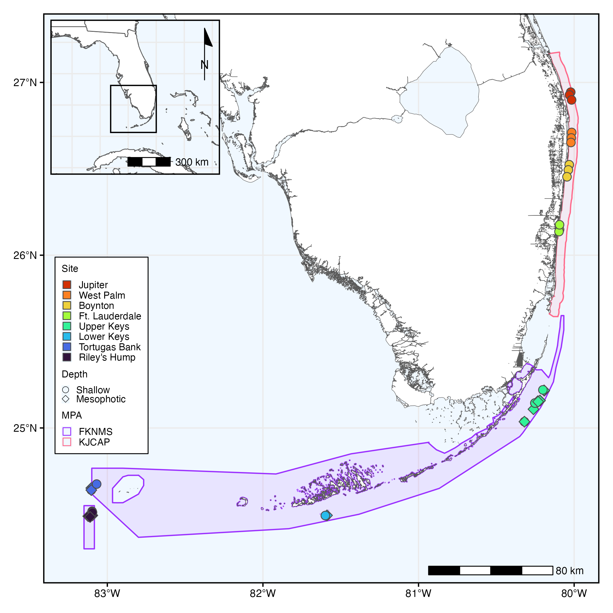

# Xestospongia_FL_PopGen
 

### Ryan Eckert -- <ryan.j.eckert@gmail.com>
### [ryanjeckert.weebly.com](https://ryanjeckert.weebly.com)
### version: 20 August, 2024

------------------------------------------------------------------------

[//]: # (This repository contains scripts and data associated with the publication:)  
<!--**[Eckert RJ, Sturm AB, Carreiro AMM, Voss JD (xxx). Population genetics of the Giant Barrel Sponge, *Xestospongia muta* across Southeast Florida. **](https://)**)-->

------------------------------------------------------------------------

------------------------------------------------------------------------

2bRAD Lab protocols adapted from [Misha Matz](https://docs.google.com/document/d/1am7L_Pa5JQ4sSx0eT5j4vdNPy5FUAtMZRsJZ0Ar5g9U/edit?usp=sharing)

------------------------------------------------------------------------

#### Protocols and walkthroughs accompanying this manuscript:

1.  [Protocol for DNA extraction](https://ryaneckert.github.io/labProtocols/dnaExtraction/)
2.  [Protocol for 2bRAD wet lab (based on https://github.com/z0on/2bRAD_denovo)](https://ryaneckert.github.io/labProtocols/2bRAD/)
3.  [2bRAD denovo analysis (adapted from https://github.com/z0on/2bRAD_denovo)](https://ryaneckert.github.io/Xestospongia_FL_PopGen/code/)
4.  [Statistical analysis of SNP data](https://ryaneckert.github.io/Xestospongia_FL_PopGen/data/)

------------------------------------------------------------------------
