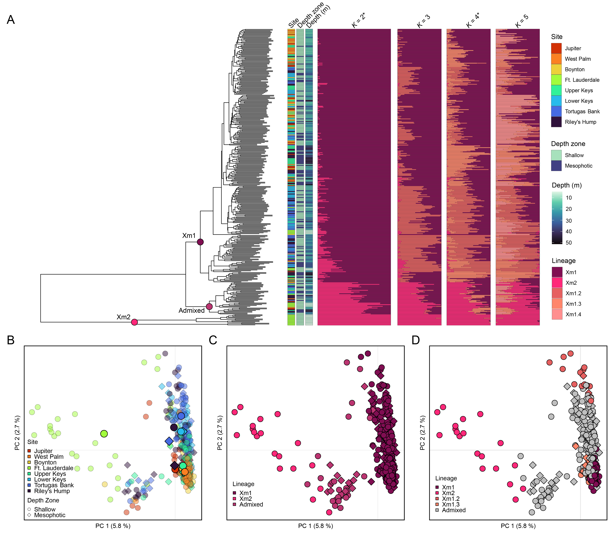

# Xestospongia_FL_PopGen
 

### Ryan Eckert -- <ryan.j.eckert@gmail.com>
### [ryanjeckert.weebly.com](https://ryanjeckert.weebly.com)
### version: 12 February, 2025

------------------------------------------------------------------------
  

This repository contains scripts and data associated with the publication:

**[Eckert RJ, Sturm AB, Carreiro AMM, Voss JD (in review). Population genetics of the giant barrel sponge, *Xestospongia muta*, reveal distinct, hybridizing lineages across the Florida Reef Tract.](https://)**

------------------------------------------------------------------------

With recent anthropogenically driven coral reef declines, reef biodiversity and resilience has become a top priority for natural resource management. Population genetic analyses can not only provide useful data for understanding genetic diversity and connectivity but also help guide restoration and conservation of critical species and habitats. The Giant Barrel Sponge, *Xestospongia muta*, is among the most conspicuous and abundant sponges on the Florida reef tract and provides important ecosystem services including nutrient cycling and three-dimensional habitat for fishes and invertebrates. To better understand X. muta population structure and connectivity throughout Florida Keys National Marine Sanctuary and Kristen Jacobs Coral Aquatic Preserve we genotyped individuals using 2bRAD-Seq across seven reef locations. Our analyses revealed strong evidence of connectivity among *X. muta* populations across the Florida Reef Tract, with the exception of a relatively distinct population located in Fort Lauderdale. Two highly divergent lineages comprise Florida’s *X. muta* populations, with clear evidence of hybridization indicating they are likely not separate species. While the lineage from Ft. Lauderdale exhibits greater genetic diversity than the other more common lineage, the levels of *X. muta* genetic diversity observed across the Florida reef were relatively consistent with several coral species sampled in this region. These data contribute to our growing understanding of the genetic diversity and connectivity of important benthic invertebrate populations across the Florida reef tract. 

------------------------------------------------------------------------

2bRAD Lab protocols adapted from [Misha Matz](https://docs.google.com/document/d/1am7L_Pa5JQ4sSx0eT5j4vdNPy5FUAtMZRsJZ0Ar5g9U/edit?usp=sharing)

------------------------------------------------------------------------

#### Protocols and walkthroughs accompanying this manuscript:

1.  [Protocol for DNA extraction](https://ryaneckert.github.io/labProtocols/dnaExtraction/)
2.  [Protocol for 2bRAD wet lab (based on https://github.com/z0on/2bRAD_denovo)](https://ryaneckert.github.io/labProtocols/2bRAD/)
3.  [2bRAD denovo analysis (adapted from https://github.com/z0on/2bRAD_denovo)](https://ryaneckert.github.io/Xestospongia_FL_PopGen/code/)
4.  [Statistical analysis of SNP data](https://ryaneckert.github.io/Xestospongia_FL_PopGen/data/)

------------------------------------------------------------------------
